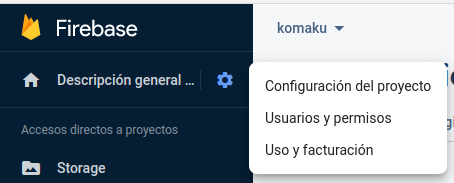

### Set the enviroment variables

Configure the keys in the enviroment variables.

To get those variables:

1. Go to your project in firebase.

2. Then select the configuration icon:


3. Then select "configuracion del proyecto":



4. Scroll and take the keys from this object:

```js
const firebaseConfig = {
  apiKey: "***********",
  authDomain: "***********",
  projectId: "***********",
  storageBucket: "***********",
  messagingSenderId: "***********",
  appId: "***********",
  measurementId: "***********",
};
```

5. Paste them like this in the .env (create a file called .env):

```env
FIREBASE_API_KEY="*******************"
FIREBASE_AUTHDOMAIN="*******************"
FIREBASE_PROJECTID="*******************"
FIREBASE_STORAGEBUCKET="*******************"
FIREBASE_MESSAGINGSENDERID="*******************"
FIREBASE_APPID="*******************"
FIREBASE_MEASUREMENTID="*******************"
```

6. Create a user in the authentication field of firebase. This is to **ignore the rules** you have created.

    6.1. Go to the authentication menu:
  
    

    6.2. Click on add user and put an email and a password:
    
    
    

    6.3. Take the userID.

    

    6.4 Go to the storage, to the rules section and add the following rule (**Do not forget to remove the rule after moving your files!!**):
    ```
      match /{allPaths=**} {
        allow read, write: if request.auth.uid == "<USER_ID_COPIED>";
      }
    ```

    6.5. Add the user and the password into the .env:
    ```env
    FIREBASE_AUTH_EMAIL="*******************"
    FIREBASE_AUTH_PASSWORD="*******************"
    ```


### Set the actions

Actions are simple. You just put the route from which you want to move something and the new route.

**The actions are set in the actions.json file**

There are several types of actions:
* **simple-move**: Simply moves all the content in the ***takeFrom*** route and puts it in the ***moveTo*** route.
* **firestore-update-route**: Taking into account the ***collection***, it takes all the elements in that collection, then it checks the ***routeField*** in the firestore element and finally it moves the file in the storage to the ***moveTo*** route while it updates the entry in the firestore object. You can add extra folders into de route by adding ***params*** (optional). Each param needs a ***name*** (name of the field in the firestore element) and a ***representation*** (string representing that field in the *moveTo* string). ***If you want to use this option, the same rule added to the storage must be added to the firestore***.
* **firestore-update-route-name**: The same as firestore-update-route but it changes the name of the file. The new name is common and it should be represented in the ***newName*** field (extension of the file is not changed). ***THE CODE ASSUMES THAT THERE ARE NOT '.' IN THE NAME***.
  For example:
      * **Valid names**: adjnajajnjad.gif, aidon42aiu12na.png.
      * **Invalid names**: 123.23.gif, adicad.gadifa.png

Actions example:

```json
[
  {
    "type": "simple-move",
    "takeFrom": "/test1",
    "moveTo": "/moveTest"
  },
  {
    "type": "firestore-update-route",
    "collection": "collection_test",
    "routeField": "img",
    "params": [
      {"name": "id", "representation": "{id}"}
    ],
    "moveTo": "/moveTest/{id}"
  },
  ,
  {
    "type": "firestore-update-route",
    "collection": "collection_test",
    "routeField": "img",
    "moveTo": "/moveTest/" // Without params allowed
  },
  ,
  {
    "type": "firestore-update-route-name",
    "collection": "collection_test",
    "routeField": "img",
    "params": [
      {"name": "id", "representation": "{id}"}
    ],
    "moveTo": "/moveTest/{id}",
    "newName": "avatar"
  }
]
```

The action is the object which is within a list, you can put as many actions as you want in the list, so that in one execution you move everything you want.

### Execute

```
node app
```